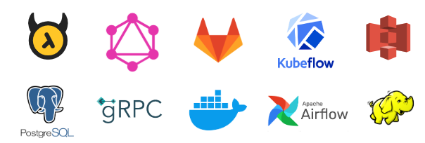

.. Professional Activities documentation master file, created by
   sphinx-quickstart on Sun Dec 20 22:05:46 2020.
   You can adapt this file completely to your liking, but it should at least
   contain the root `toctree` directive.

2020 Retrospective
==================

The year 2020 with the pandemic was for sure so difficult for all of us. 
Still,  besides the atrocities of the CO-VID and brutal isolation, this year was a new interesting chapeter for me (well, you know workwise!)

I have never called myself a data scientist and probably will not!,
... but this year working with the Data Science and Optimization team of the Shell Energy Platform was really both challenging and fun! 
well fun in that I learned a lot and tried many new things. 
After the Q4 retro of the team I thought to look back at what I did and learned this year. 
I think to me somehow it portrays of a newbie's journey of entrace to tech! from gitlab to docker, kubernetes, kubeflow, and micro services.
I'd be naive to think I have done any more than scratching the surface on any of these, but let's just say I am happy to play with these new toys!

Here is what I could recall form this year's experience.

Q1 Theme: ERCOT 24x7 trader UI Stubbed Sim
-------------------------------------------
**January**
   * Understand the Optimization team elegant design patterns! 
   * Catching up with all the Tech Buzz words and acronyms!
   * First Stab at Optimal Bidding. 
   * Market Structures from Texas (ERCOT) to UK (EPEX and ELEXON)
   * First API calls to ELEXON public DB
**February**
   * Introduced to Orchestration concepts and Airflow
   * Working with Power Workbench ( a cloud-based development env)
   * Working with AWS S3, console, CLI, and python API
   * PostGres, Querries and pushing data in PGAdmin, and python API SQLAlchemy
**March**
   * Developed First Module and First DAG in Dev and Stage
   * First 24x7 optimization and bidding module for real assets in ERCOT
   * Intro to GitLab, and CICD basics
   * Intro to Containerization and Docker

Q2 Theme: ERCOT Wrap-up, Italy Trader UI
-----------------------------------------
**April**
   * Intro to JSON Schema, proper json data definition, QuickType and other tools for json data validation
   * More pressure on proper testing and a logging practices!
   * Running Docker images and containers
   * Intro to Kubeflow for building pipelines
   * Feeling the heat and sweat of code testing, 24x7 issue tracking and bug fixing!
**May**
   * Building the 24x7 the proper way; separating the applications with clear I/O requirements and  testing
   * More pressure on code development with containerization in mind 
   * Intro to GraphQL, and Hassura
   * Secret management,  env files where to put them, how to use them, and deploy them
**June**
   * Intro to CICD yaml files
   * First module to be used in production used by Italian traders! 
   * Really feeling the need for UMLs!

Q3 Theme:  MP2 Position Manager
-------------------------------
**July**
   * More struggle with data hierarchies and hierarchy mapping
   * Writing Dockerfiles and building docker images
   * Intro to KubeFlow Kale a tool for building pipelines within the code
   * Writing querries and mutations in Hasura
**August**
   * Intro to Kafka, message consumers and producers
   * Architecture design for scheduling app
   * Intro to building package, first effort in building a library
   * Setting up docker containers and docker networks with DBs
**September**
   * Secret management nightmare, the journey from env files to kubeflow vault
   * Integrated Optimal Bidding Scheduling with Stochastic Optimization
   * Intro to Hadoop HDFS in docker and toy mapreduce models

Q4  Theme: Everything Refactored!
---------------------------------
**October**
   * Intro to Micro Services
   * Intro to Protocol Buffers and gRPC
   * Working with a gRPC server
**November**
   * Intro to golang
   * More on protobuf and gRPC and python representations
   * PoC of solving asset optimization with ORtools protobuf
**December**
   * Intro to gRPC server client design
   * First PoC of complete gRPC client/server implementation for asset optimization 
   * Intro to Sphinx! 

